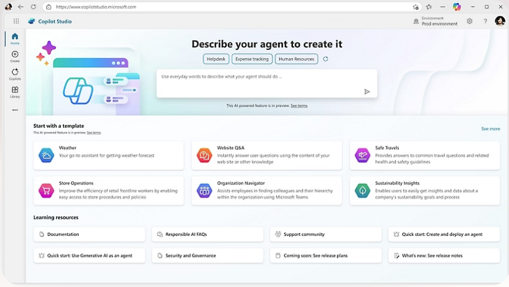
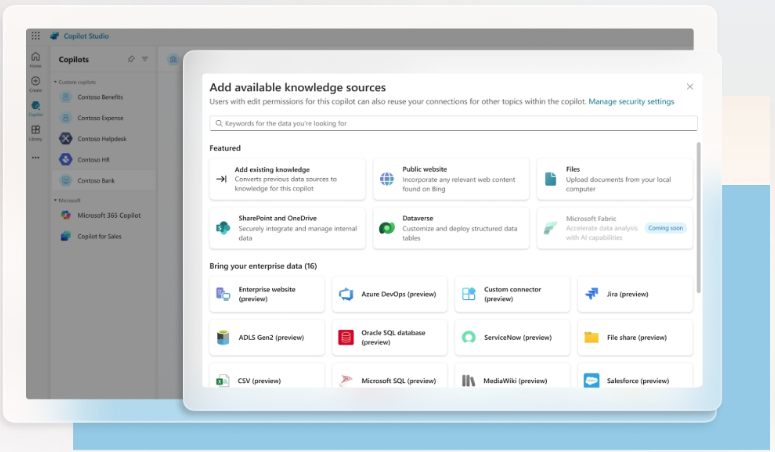
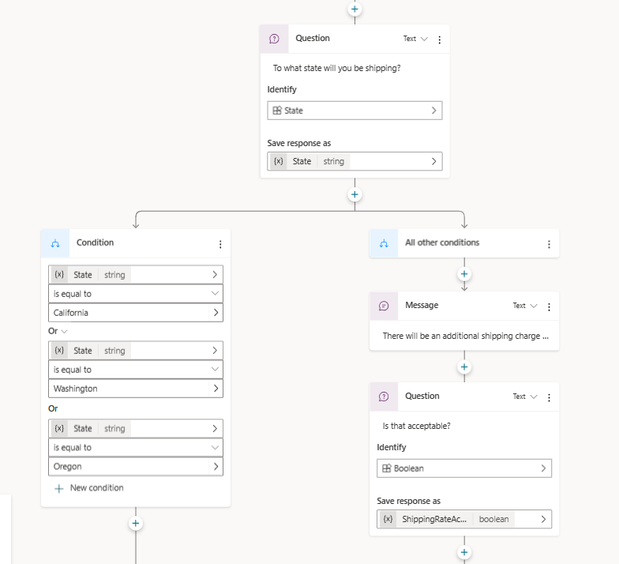
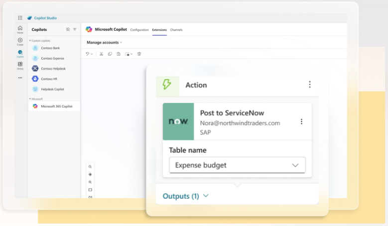
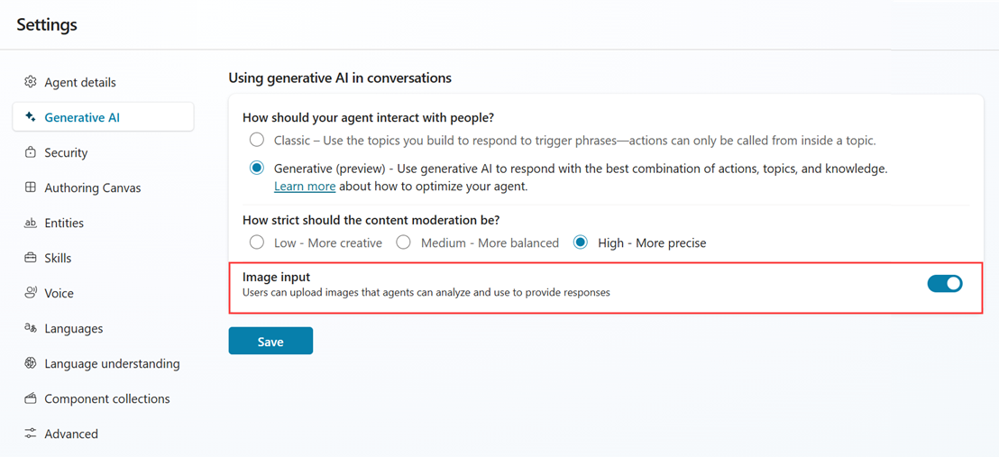

# 🚀 **Tutorial: Criando um Fluxo de Conversa Personalizado no Copilot Studio**  

## 🚀 Desafio: Conhecendo o Microsoft Copilot Studio
Este repositório contém um resumo do aprendizado sobre Microsoft Copilot Studio, incluindo conceitos fundamentais e o funcionamento dos ambientes dentro da plataforma. Além disso, relato a dificuldade encontrada ao tentar criar uma conta gratuita.

### **📌 1. O que é o Microsoft Copilot Studio?**  

> O **Microsoft Copilot Studio** é uma plataforma da Microsoft que permite criar **assistentes virtuais** inteligentes para ajudar em diferentes tarefas, como atendimento ao cliente e suporte interno de empresas.

**🔹 Importância:**  
- Automatiza conversas e processos.  
- Integra-se a sistemas corporativos.  
- Pode ser usado sem precisar programar.  

✅ **Imagem ilustrativa sobre o Microsoft Copilot Studio.**
<p align="center">
  
</p>  

---

### **📌 2. Criando um Copilot em Branco**  

> **Por que isso é importante?**  
> Criar um **Copilot em Branco** permite construir um assistente do zero, totalmente personalizado.

#### **Passos:**  
1. Acesse o portal do [Microsoft Copilot Studio](https://copilotstudio.microsoft.com/).  
2. Clique em **"Criar um novo Copilot"**.  
3. Escolha a opção **"Copilot em branco"**.  
4. Dê um nome ao seu projeto, como **"Assistente de Viagens"**, e clique em **"Criar"**.  

✅ **Imagem mostrando a tela de criação do Copilot em Branco.** 
<p align="center">
  
</p> 

---

### **📌 3. Customizando um Tópico**  

> **O que é um Tópico?**  
> Um tópico define um conjunto de perguntas e respostas para o Copilot. Ele permite que o assistente entenda e responda corretamente ao usuário.

#### **Passos:**  
1. Vá para **Tópicos** → Clique em **"Novo Tópico"**.  
2. Dê um nome ao tópico, por exemplo, **"Ajuda com Viagens"**.  
3. Adicione frases de ativação, como:  
   - "Quais documentos preciso para viajar?"  
   - "Como tirar passaporte?"  
4. No editor, defina a resposta do Copilot, como:  
   - `"Você precisa de um passaporte válido e visto, dependendo do destino."`  

✅ **Imagem mostrando a criação de um Tópico no Copilot Studio.**
<p align="center">
  
</p>  

---

### **📌 4. Personalizando uma Mensagem de Erro**  

> **Por que isso é importante?**  
> Se o Copilot não entender a pergunta do usuário, ele precisa responder de forma clara e amigável para evitar frustração.

#### **Passos:**  
1. Vá até **Configurações** → **Respostas Padrão**.  
2. Edite a mensagem de erro, por exemplo:  
   - `"Desculpe, não entendi. Poderia reformular?"`  
   - `"Ainda estou aprendendo! Tente perguntar de outra forma."`  

✅ **Imagem mostrando a tela de configuração da mensagem de erro.**
<p align="center">
  
</p>  

---

### **📌 5. Ajustando a Qualidade das Respostas com IA**  

> **Por que isso é importante?**  
> A inteligência artificial pode gerar respostas mais criativas ou mais precisas, dependendo da necessidade.

#### **Passos:**  
1. Vá para **Configurações** → **Ajuste de Respostas**.  
2. Ajuste o controle deslizante entre:  
   - **Mais preciso** (respostas diretas e objetivas).  
   - **Mais criativo** (respostas mais elaboradas).  

✅ **Imagem mostrando o ajuste da criatividade da IA.** 
<p align="center">
  
</p> 

---

Aqui está um **fluxograma** ilustrando o processo de criação de um **Copiloto com Fluxo de Conversa Personalizado no Microsoft Copilot Studio**.  

### 🔹 **Cenário:**  
Criar uma **ação de conversa básica** e publicá-la no **Microsoft 365 Copilot**.  

---

### **📝 Roteiro:**
1️⃣ **Acessar o Copilot Studio**  
2️⃣ **Criar uma nova ação de conversa**  
3️⃣ **Configurar os elementos da conversa**  
4️⃣ **Testar e validar o fluxo**  
5️⃣ **Publicar no Microsoft 365 Copilot**  

---

Agora, vamos gerar um **fluxograma visual** representando esse processo! 🎨📊  

🔄 **Exemplo de fluxo.**

Aqui está o **fluxograma** ilustrando o processo de criação de um **Copiloto com Fluxo de Conversa Personalizado no Microsoft Copilot Studio**.  

📌 **Baixe a imagem do fluxo aqui:**  
[📥 Fluxograma - Criando um Copiloto](sandbox:/mnt/data/fluxo_copilot_conversa.png) 
<p align="center">
  
</p> 


Este diagrama pode ser usado na sua apresentação para demonstrar visualmente o passo a passo do processo. 🚀
from graphviz import Digraph

from graphviz import Digraph

# Criando um objeto de fluxograma
fluxo = Digraph(format='png')

# Definição dos nós do fluxograma
fluxo.node('A', 'Início')

fluxo.node('B', 'Acessar Microsoft Copilot Studio\n(Painel de Navegação → Agentes)')

fluxo.node('C', 'Selecionar Microsoft 365 Copilot')

fluxo.node('D', 'Acessar a guia Ações')

fluxo.node('E', 'Selecionar "+ Adicionar ação"')

fluxo.node('F', 'Criar Nova Ação\n(Selecionar "Conversacional")')

fluxo.node('G', 'Definir Nome e Idioma Principal')

fluxo.node('H', 'Configurar Fluxo de Conversa\n(Definir perguntas, respostas e ações)')

fluxo.node('I', 'Testar e Validar o Fluxo')

fluxo.node('J', 'Publicar no Microsoft 365 Copilot')

fluxo.node('K', 'Fim')

# Definição das conexões entre os nós
fluxo.edges(['AB', 'BC', 'CD', 'DE', 'EF', 'FG', 'GH', 'HI', 'IJ', 'JK'])

# Renderizando o fluxograma
fluxo_path = "/mnt/data/fluxo_copilot_conversa"
fluxo.render(fluxo_path)

# Retornando o caminho da imagem gerada
fluxo_path + ".png"


## 📌 **Passo a Passo para Criar o Projeto no GitHub**  

### **1️⃣ Criando o Repositório no GitHub**  

> **Por que isso é importante?**  
> Criar um repositório no GitHub permite armazenar e compartilhar seu tutorial com outras pessoas. Além disso, ele serve como um portfólio para mostrar seu aprendizado.

#### **Passos para criar o repositório:**  
1. Acesse o [GitHub](https://github.com/) e faça login.  
2. No canto superior direito, clique em **"New Repository"** (Novo Repositório).  
3. Defina um nome, como **"tutorial-copilot-studio"**.  
4. Marque a opção **"Public"** (público para compartilhar).  
5. Selecione **"Add a README file"** para iniciar com um arquivo de documentação.  
6. Clique em **"Create Repository"**.  
  

---

### **2️⃣ Clonando o Repositório no VS Code**  

> **Por que isso é importante?**  
> Clonar o repositório permite editar os arquivos localmente no seu computador, facilitando a adição de conteúdo e imagens.

#### **Passos:**  
1. Abra o **VS Code**.  
2. No terminal, digite:  
   ```sh
   git clone https://github.com/seu-usuario/Copiloto-Micrsoft-Copilot-Studio-desafio02.git
   ```
3. Entre no diretório clonado:  
   ```sh
   cd Copiloto-Micrsoft-Copilot-Studio-desafio02
   ```
 

---

## **📂 Publicando no GitHub**  

> Agora que o tutorial está pronto, precisamos enviar para o repositório no GitHub.

#### **Passos:**  
1. No VS Code, execute:  
   ```sh
   git add README.md
   git commit -m "Criando um Fluxo de Conversa Personalizado no Copilot Studio"
   git push origin main
   ```
2. Acesse o GitHub e verifique se o tutorial está publicado.  
3. Compartilhe o link do repositório na entrega do desafio.  
 

---

## 🎯 **Conclusão**  

Parabéns! 🎉 Você aprendeu a:  
✅ Criar um **Copilot em Branco** no Microsoft Copilot Studio.  
✅ Configurar **Tópicos** para interação.  
✅ Personalizar **Mensagens de Erro**.  
✅ Ajustar a **qualidade das respostas** com IA.  
✅ Publicar tudo no **GitHub**.  

Agora, você pode explorar mais funcionalidades e criar assistentes ainda mais inteligentes! 🚀  

---

## **📎 Link do Repositório**  
*(Aqui, você adiciona o link do seu repositório no GitHub para entrega do desafio.)*  

---

### **📌 Próximos Passos**  
🔹 Testar a integração do Copilot com outros sistemas.  
🔹 Criar um Copilot para um caso real, como suporte ao cliente.  
🔹 Explorar os recursos avançados de IA no Copilot Studio.  

---
# Copiloto-Micrsoft-Copilot-Studio-desafio02
